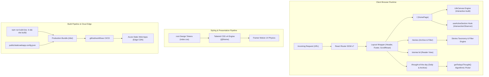

<div align="center">

# 🌿 LifeOps — Engineering & Technical Architecture

### *High-Performance, Editorial Intentional Living Platform*

A statically compiled, modern Single Page Application (SPA) pairing editorial typography with interactive wellness tooling, reactive state engines, and automated cloud edge deployment.

<br />

[](https://react.dev/)
[](https://www.typescriptlang.org/)
[](https://vitejs.dev/)
[](https://tailwindcss.com/)
[](https://reactrouter.com/)
[](https://www.framer.com/motion/)
[](https://azure.microsoft.com/services/app-service/static/)
[](https://oxc.rs/)

<br />

[🏗️ System Architecture](#-system-architecture) • [⚡ Technology Stack](#-technology-stack--engineering-rationales) • [🧭 Routing & Lifecycle](#-routing--navigation-lifecycle) • [🧠 Reactive State Engines](#-reactive-state-engines--algorithms) • [🎨 Design Token Architecture](#-editorial-design-system--token-architecture) • [☁️ Azure CI/CD Pipeline](#️-devops--azure-static-web-apps-deployment)

</div>

---

## 📌 Executive Technical Overview

**LifeOps** is an editorial web application constructed to demonstrate high aesthetic fidelity without sacrificing modern web engineering rigor. Combining the speed of **Vite 8** with **React 19**, strict **TypeScript**, **Tailwind CSS v4**, and **Framer Motion 14**, the platform delivers an immersive reading experience, interactive mindfulness auditing tools, and dynamic content feeds.

### Key Engineering Attributes:
- **Zero-Latency Navigation**: Single Page Application routing via **React Router DOM v7** coupled with layout-level scroll preservation and Azure SPA rewrite rules.
- **Hardware-Accelerated Fluid Animations**: GPU-bound spring and tween physics via Framer Motion with reduced-motion accessibility accommodations (`prefers-reduced-motion`).
- **Deterministic Algorithmic Content Selection**: Dynamic date matching with circular day-of-year fallback for daily thought rotation.
- **Zero-Dependency Interactive CLI Tools**: Built-in Node.js ES modules using `node:readline/promises` to generate and append structured content directly to typed codebases.
- **Strict Linting & Compilation**: Zero warnings with `tsc -b` strict type checking and sub-second validation via `oxlint`.

---

## 🏗️ System Architecture



---

## ⚡ Technology Stack & Engineering Rationales

| Layer | Technology | Version | Engineering Rationale |
|:---|:---|:---:|:---|
| **Runtime Core** | [React](https://react.dev/) | `19.2.8` | Next-generation React core with modern concurrent rendering optimizations and streamlined DOM hydration. |
| **Language** | [TypeScript](https://www.typescriptlang.org/) | `6.0.2` | Strict compile-time safety across domain models (`Story`, `ThoughtOfTheDay`), preventing runtime null-pointer and type regressions. |
| **Bundler & HMR** | [Vite](https://vitejs.dev/) | `8.3.2` | Lightning-fast Hot Module Replacement (HMR) powered by ESBuild, tree-shaking, and production asset minification. |
| **Styling Engine** | [Tailwind CSS](https://tailwindcss.com/) | `4.3.3` | Next-gen zero-config CSS parser utilizing native `@theme` directives without bloated PostCSS configurations. |
| **Routing** | [React Router](https://reactrouter.com/) | `7.18.4` | First-class SPA client-side routing, URL parameter extraction, dynamic nested route layouts, and programmatic navigation. |
| **Motion Physics** | [Framer Motion](https://www.framer.com/motion/) | `14.0.0` | Declarative, GPU-accelerated motion orchestrations, spring physics, exit animations via `AnimatePresence`, and scroll-reveal triggers. |
| **Iconography** | [Lucide React](https://lucide.dev/) | `1.51.0` | Ultra-lightweight SVG icon primitives treeshaken down to individual glyph imports. |
| **Static Linter** | [Oxlint](https://oxc.rs/) | `1.81.0` | High-performance Rust-based JavaScript/TypeScript linter executing up to 50x faster than traditional ESLint setups. |
| **Cloud Hosting** | [Azure Static Web Apps](https://azure.microsoft.com/) | Cloud | Global edge CDN distribution with integrated GitHub Actions CI/CD workflows and automated SSL provisioning. |

---

## 🧭 Routing & Navigation Lifecycle

The application operates as a single-bundle Single Page Application (SPA) driven by `react-router-dom`:

```tsx
// src/App.tsx Route Hierarchy
<BrowserRouter>
  <Routes>
    <Route element={<Layout />}>
      <Route path="/" element={<HomePage />} />
      <Route path="/stories" element={<StoriesPage />} />
      <Route path="/stories/:id" element={<StoryDetailPage />} />
      <Route path="/thought-of-the-day" element={<ThoughtOfTheDayPage />} />
    </Route>
  </Routes>
</BrowserRouter>
```

### 1. Scroll Restoration & Layout Shell
In [`src/pages/Layout.tsx`](src/pages/Layout.tsx), route transitions are automatically monitored via the `useLocation()` hook. Upon each path change (`pathname`), window scroll position is instantly reset to `(0, 0)`, preventing carry-over scroll depths across pages:

```tsx
useEffect(() => {
  window.scrollTo(0, 0)
}, [pathname])
```

### 2. Dual-Mode Intelligent Header (`Navbar.tsx`)
The navigation header provides dual-mode intelligence:
- **On `/` (Home)**: Clicking anchor links (`#philosophy`, `#pillars`, `#rituals`, etc.) performs native smooth scrolling without full-page reloads, while the `useActiveSection` hook highlights the currently visible section.
- **On Sub-routes (`/stories`, `/thought-of-the-day`)**: Clicking home anchors programmatically routes back to `/` with the appropriate hash parameter, smoothly redirecting the user back into the landing flow.

### 3. Azure Static Web Apps Deep-Linking Rewrite Rule
Directly requesting client-side deep routes (e.g., `https://domain.com/stories/the-midnight-train-to-florence`) on static storage typically triggers HTTP 404 errors. This is solved via [`public/staticwebapp.config.json`](public/staticwebapp.config.json), which instructs Azure edge servers to route all HTML traffic back to `/index.html`:

```json
{
  "navigationFallback": {
    "rewrite": "/index.html",
    "exclude": ["/images/*.{png,jpg,gif,svg}", "/favicon.svg", "/icons.svg", "/assets/*"]
  },
  "mimeTypes": {
    ".json": "text/json"
  }
}
```

---

## 🧠 Reactive State Engines & Algorithms

### 1. Daily Thought Resolution Algorithm (`thoughts.ts`)
The `getTodaysThought()` resolver ensures deterministic content matching based on the client's current date, with a circular fallback mechanism guaranteeing an uninterrupted user experience:

```typescript
export function getTodaysThought(): ThoughtOfTheDay {
  const today = new Date().toISOString().split('T')[0] // 'YYYY-MM-DD'
  const todaysThought = thoughts.find((t) => t.date === today)
  return todaysThought || thoughts[0]
}
```

### 2. Stories Taxonomy & Dynamic Filter Engine (`StoriesPage.tsx`)
Stories are dynamically indexed and memoized in real-time. Categories are computed without duplicate entries, and UI states transition via Framer Motion's `AnimatePresence`:

```typescript
// Dynamic category extraction with count tracking
const categories = useMemo(() => {
  const cats = Array.from(new Set(stories.map((s) => s.category)))
  return ['All', ...cats]
}, [])

const filteredStories = useMemo(() => {
  if (selectedCategory === 'All') return stories
  return stories.filter(
    (s) => s.category.toLowerCase() === selectedCategory.toLowerCase()
  )
}, [selectedCategory])
```

### 3. Scroll Spy Engine (`useActiveSection.ts`)
Tracks active viewport positioning across 12 distinct DOM elements using the native `IntersectionObserver` API configured with asymmetric root margins to bias towards user reading focus:

```typescript
const observer = new IntersectionObserver(
  (entries) => {
    const visible = entries
      .filter((entry) => entry.isIntersecting)
      .sort((a, b) => b.intersectionRatio - a.intersectionRatio)

    if (visible.length > 0) {
      const id = visible[0].target.id
      if (sections.includes(id)) setActiveSection(id)
    }
  },
  {
    rootMargin: '-20% 0px -60% 0px',
    threshold: [0, 0.1, 0.25, 0.5],
  }
)
```

### 4. Interactive Fulfillment Auditor (`LifeCanvas.tsx`)
An interactive self-reflection engine allowing users to toggle dimensions, record qualitative intentions, compute active life fulfillment areas, and export data directly to clipboard or native print formats (`window.print()`).

---

## 🎨 Editorial Design System & Token Architecture

LifeOps replaces generic design abstractions with a tailored editorial design system defined in [`src/index.css`](src/index.css) via the Tailwind CSS v4 `@theme` directive.

### Color Palette Tokens

```css
@theme {
  --color-ivory: #F8F7F2;       /* Base background canvas */
  --color-cream: #EFEDE5;       /* Elevated container backgrounds */
  --color-charcoal: #242722;    /* Primary editorial typography */
  --color-stone: #77796F;       /* Secondary body & caption copy */
  --color-sage: #82927B;        /* Primary organic accent */
  --color-sage-light: #9AA894;  /* Hover & secondary highlights */
  --color-sage-dark: #6B7A64;   /* Deep interactive accents */
  --color-forest: #202820;      /* Dark cards & high-contrast sections */
  --color-forest-light: #2A3A2A;/* Card hover elevations */
  --color-gold: #C4A879;        /* Warm typographic badges */
  --color-gold-light: #D4BC95;  /* Subtle metallic accents */
  --color-border: #E5E3DC;      /* Delicate structural dividers */
  --color-white: #FFFFFF;       /* Pure white highlights */
}
```

### Fluid Typographic Scaling
Headings utilize mathematically tuned fluid `clamp()` formulas that seamlessly scale between mobile viewports and large desktop monitors without abrupt media query breakpoints:

```css
.heading-display {
  font-family: var(--font-serif);
  font-size: clamp(2.5rem, 5vw + 1rem, 5rem);
  line-height: 1.1;
  letter-spacing: -0.02em;
}

.heading-editorial {
  font-family: var(--font-serif);
  font-size: clamp(2rem, 4vw + 0.5rem, 3.5rem);
  line-height: 1.15;
}

.heading-pillar {
  font-family: var(--font-serif);
  font-size: clamp(1.5rem, 2.5vw + 0.5rem, 2.25rem);
  line-height: 1.2;
}
```

### Accessibility & Reduced Motion
In strict compliance with WCAG guidelines, all CSS transitions, animations, and smooth-scrolling behaviors gracefully degrade for users with motion sensitivities:

```css
@media (prefers-reduced-motion: reduce) {
  *, *::before, *::after {
    animation-duration: 0.01ms !important;
    animation-iteration-count: 1 !important;
    transition-duration: 0.01ms !important;
    scroll-behavior: auto !important;
  }
}
```

---

## 📂 Project Architecture Blueprint

```text
lifeops-static-page/
├── .github/
│   └── workflows/
│       └── azure-static-web-apps-*.yml # Automated OIDC Azure CI/CD Pipeline
├── public/
│   ├── staticwebapp.config.json        # Azure SWA SPA navigation routing rules
│   ├── favicon.svg                     # Site vector favicon
│   ├── icons.svg                       # SVG sprite definitions
│   └── images/                         # Static visual assets
├── scripts/
│   ├── add-story.mjs                   # Interactive CLI generator for stories
│   └── add-thought.mjs                 # Interactive CLI generator for daily thoughts
├── src/
│   ├── components/                     # Modular presentation components
│   │   ├── DailyRituals.tsx            # 4-stage daily routine interactive tabs
│   │   ├── FinalCTA.tsx                # Newsletter & concluding call to action
│   │   ├── Footer.tsx                  # Dynamic dual-mode router-aware footer
│   │   ├── Hero.tsx                    # Atmospheric landing hero section
│   │   ├── ImperfectLife.tsx           # Wabi-sabi philosophy presentation
│   │   ├── Journal.tsx                 # Micro-journaling reflective prompts
│   │   ├── LifeCanvas.tsx              # Interactive Life Audit state engine
│   │   ├── Manifesto.tsx               # Intentional living manifesto
│   │   ├── Navbar.tsx                  # Glassmorphism dual-mode sticky header
│   │   ├── Philosophy.tsx              # Core philosophical framework
│   │   ├── PillarSection.tsx           # The 6 core foundational pillars
│   │   ├── ScrollReveal.tsx            # Framer Motion intersection wrapper
│   │   ├── SectionHeading.tsx          # Reusable typography heading primitive
│   │   ├── SlowLivingGallery.tsx       # Curated photographic grid
│   │   ├── StoriesPreview.tsx          # Homepage preview of recent stories
│   │   └── ThoughtPreview.tsx          # Homepage preview of today's thought
│   ├── data/
│   │   ├── stories.ts                  # Typed Story models & article repository
│   │   └── thoughts.ts                 # Typed Thought models & rotation helpers
│   ├── hooks/
│   │   └── useActiveSection.ts         # IntersectionObserver scroll-spy hook
│   ├── pages/
│   │   ├── HomePage.tsx                # Assembled landing page experience
│   │   ├── Layout.tsx                  # Root route shell with scroll restoration
│   │   ├── StoriesPage.tsx             # Multi-category story archive & filter
│   │   ├── StoryDetailPage.tsx         # Immersive single-story reader view
│   │   └── ThoughtOfTheDayPage.tsx     # Quote card, carousel & monthly archive
│   ├── App.tsx                         # Client-side router configuration
│   ├── index.css                       # Tailwind v4 @theme & global typography
│   └── main.tsx                        # React application DOM entrypoint
├── index.html                          # HTML5 shell & Google Fonts preconnect
├── package.json                        # Node package manifest & CLI scripts
├── tsconfig.json                       # Root TypeScript project references
├── tsconfig.app.json                   # Client-side TypeScript compiler config
├── tsconfig.node.json                  # Node script TypeScript configuration
└── vite.config.ts                      # Vite 8 bundler configuration
```

---

## ⚡ Content Automation CLI Reference

The project includes purpose-built Node.js CLI tools in `scripts/` using pure `node:readline/promises` to allow updating content directly from the command line without manual JSON or TypeScript editing:

### 1. Generating a Thought of the Day
```bash
npm run add:thought
```
**Interactive prompts:**
- `Date`: Defaults to current calendar date (`YYYY-MM-DD`)
- `Thought / Quote`: Quote string
- `Author`: Defaults to `LifeOps`
- `Category`: `Presence`, `Peace`, `Intention`, `Resilience`
- `Reflection`: Practical takeaway prompt
- Automatically selects high-resolution nature photography from Unsplash and safely injects the record into [`src/data/thoughts.ts`](src/data/thoughts.ts).

### 2. Generating a Story
```bash
npm run add:story
```
**Interactive prompts:**
- `Story Title`: Generates URL slug automatically (e.g. `the-midnight-train`)
- `Subtitle`: Secondary poetic hook
- `Category`: `Romance`, `Intimate`, `Detective`, `Fiction`, `Peace`, etc.
- `Read time`: Estimated reading duration
- `Body Paragraphs`: Multiline input ended by typing `END`
- `Reflection`: Final contemplation prompt
- Automatically prepends the story to [`src/data/stories.ts`](src/data/stories.ts).

---

## ☁️ DevOps & Azure Static Web Apps Deployment

Deployments are entirely automated through GitHub Actions triggered on pushes to the `main` branch.

```yaml
# .github/workflows/azure-static-web-apps-*.yml
name: Azure Static Web Apps CI/CD

on:
  push:
    branches: [main]
  pull_request:
    types: [opened, synchronize, reopened, closed]
    branches: [main]

jobs:
  build_and_deploy_job:
    runs-on: ubuntu-latest
    steps:
      - uses: actions/checkout@v3
      - name: Build And Deploy
        uses: Azure/static-web-apps-deploy@v1
        with:
          azure_static_web_apps_api_token: ${{ secrets.AZURE_STATIC_WEB_APPS_API_TOKEN }}
          action: "upload"
          app_location: "/"          # Root of project
          api_location: ""           # Optional serverless API
          output_location: "dist"    # Vite build output
```

### Production Build Verification
Every commit triggers an automated pipeline verifying:
1. Strict TypeScript compilation via `tsc -b` (zero tolerance for unused locals, implicit `any`, or broken typings).
2. Vite 8 production bundling with Rollup code-splitting.
3. Verification of `staticwebapp.config.json` inside `/dist` for client-side routing rewrites.

---

## 🛠️ Developer Quickstart & Command Reference

### Local Environment Setup
```bash
# 1. Clone repository
git clone https://github.com/arindampersonal/lifeops-static.git
cd lifeops-static

# 2. Install dependencies
npm install

# 3. Start local development server (HMR enabled)
npm run dev
```

### Command Reference Table

| Script | Command | Purpose |
|:---|:---|:---|
| `dev` | `npm run dev` | Boots local Vite development server at `http://localhost:5173` |
| `build` | `npm run build` | Executes TypeScript validation (`tsc -b`) and builds production assets to `/dist` |
| `preview` | `npm run preview` | Locally serves the optimized production bundle from `/dist` |
| `lint` | `npm run lint` | Runs Oxlint across all TypeScript and TSX files |
| `add:thought` | `npm run add:thought` | Interactive CLI to append a new Thought of the Day record |
| `add:story` | `npm run add:story` | Interactive CLI to append a new Story record |

---

## 📄 License & Attribution

Distributed under the **MIT License**. Engineered and curated with intention by **[Arindam Dutta](https://github.com/ArindamDutta1)**.

<div align="center">
<br />
<i>“We do not manage life like a spreadsheet; we curate it like a living garden.”</i>
</div>
